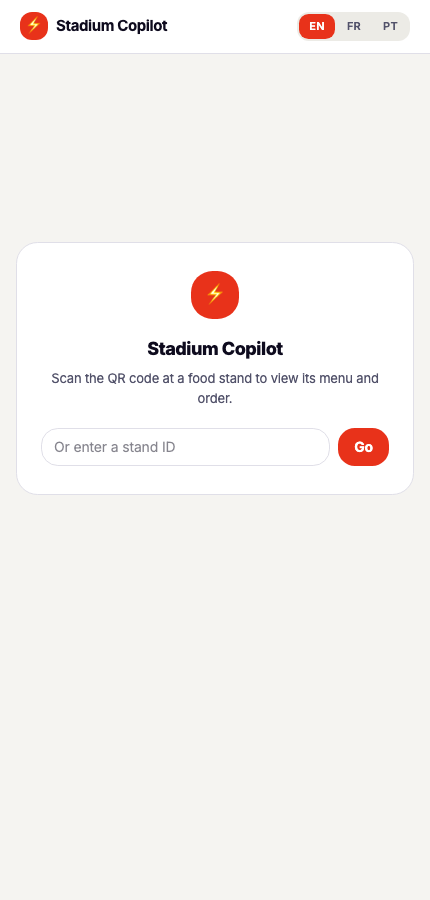
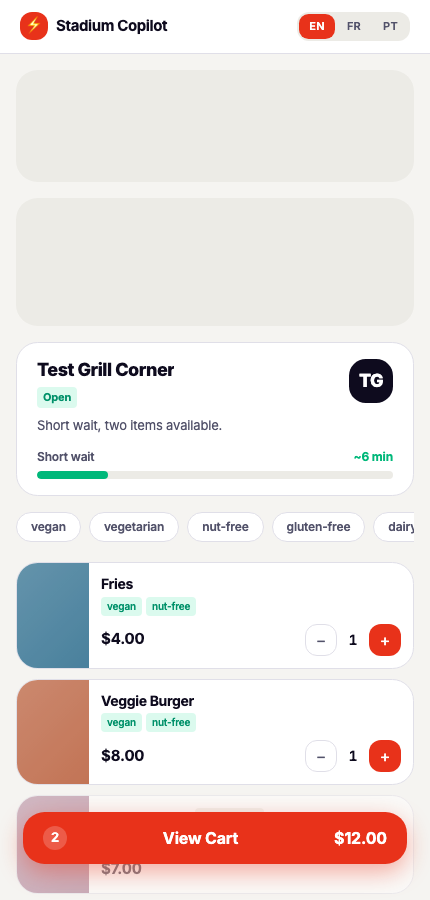
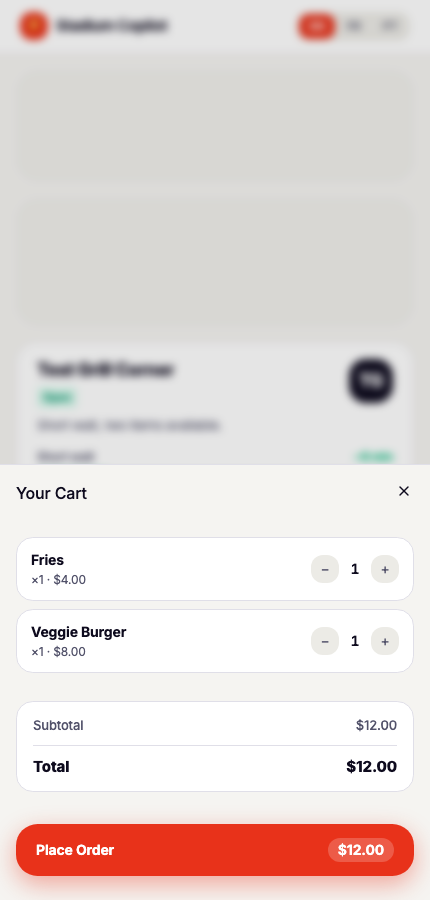
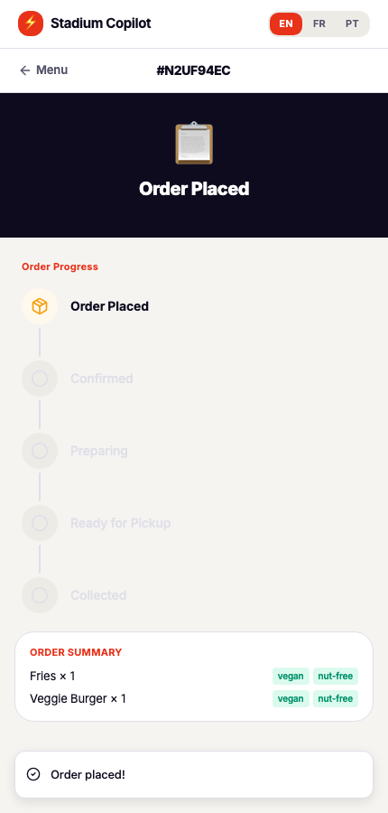
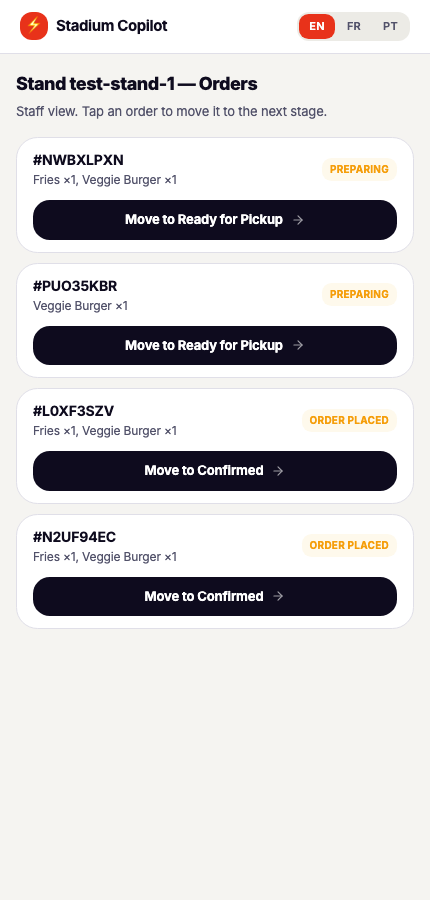

# Stadium Copilot — Frontend

React + TypeScript + Vite fan-facing UI for [Stadium Copilot](../README.md)'s queue-aware food ordering flow, plus a lightweight staff view for moving orders through their lifecycle. Talks to `order-service` only — `ingestion-service` is internal-only and never called from the browser.

## Screens

| Home (dev entry point) | Menu | Cart |
|---|---|---|
|  |  |  |

| Order status | Staff order queue |
|---|---|
|  |  |

- **Home** (`/`) — dev/demo convenience only. Fans normally land on `/menu/:standId` directly via a QR code scan at the stand; this page exists so you can jump there manually without a physical code.
- **Menu** (`/menu/:standId`) — live match banner, upcoming matches, stand queue estimate, dietary filter chips, and a Gemini-generated menu summary. Polls every 30s. Adding items shows a sticky cart bar.
- **Cart** (`CartSheet`, opened from the cart bar) — line-item editor with subtotal/total, places the order via `POST /orders`.
- **Order status** (`/orders/:orderId`) — a stepper (Placed → Confirmed → Preparing → Ready for Pickup → Collected), with a disruption banner if the order's stand closes mid-queue and Gemini reassigns it to an alternate stand or issues a refund.
- **Staff order queue** (`/stand/:standId/orders`) — tap-to-advance staff view for moving orders through their lifecycle.
- **Match detail** (`/matches/:matchId`) — live score/event view backed by ingestion-service's Redis cache (60s TTL); renders "No live match right now" when nothing is cached.

Language switching (EN/FR/PT, top right) is baked into both the UI strings (`src/lib/translations.ts`) and the menu-summary prompt sent to Gemini — not translated after the fact.

## Development

```bash
npm install
npm run dev      # http://localhost:5173
npm run build    # tsc -b && vite build
npm run lint      # oxlint
```

Point the dev server at a running `order-service` (see `../backend/README` equivalent in the root README) via `.env.local`:

```bash
echo "VITE_ORDER_SERVICE_URL=http://localhost:8080" > .env.local
```

Without this, it defaults to `http://localhost:8080` anyway. Screens that need stand/order data (Menu, Order status, Staff queue) require Firestore-backed test data — see `backend/seed-test-stand.mjs` in the root README's "One-time setup" section.

## Stack

- **Routing**: `react-router-dom` (`src/App.tsx`)
- **Styling**: Tailwind v4 + a small custom token set (`--sc-*` CSS vars in `src/index.css`) rather than a full design system — this is a hackathon-scoped UI, not a component library.
- **UI primitives**: shadcn/Base UI components under `src/components/ui/`
- **State**: no global store — `useCart` (localStorage-backed) and `usePolling` (interval-based refetch) are the only custom hooks; everything else is local component state.
- **Language**: `LanguageProvider` (`src/lib/language.tsx`) + `T[language]` string lookups (`src/lib/translations.ts`)

## Deployment

Firebase Hosting is the intended target (`firebase-tools` is already a dev dependency) but no `firebase.json` / hosting config exists yet — deployment has not been wired up.
